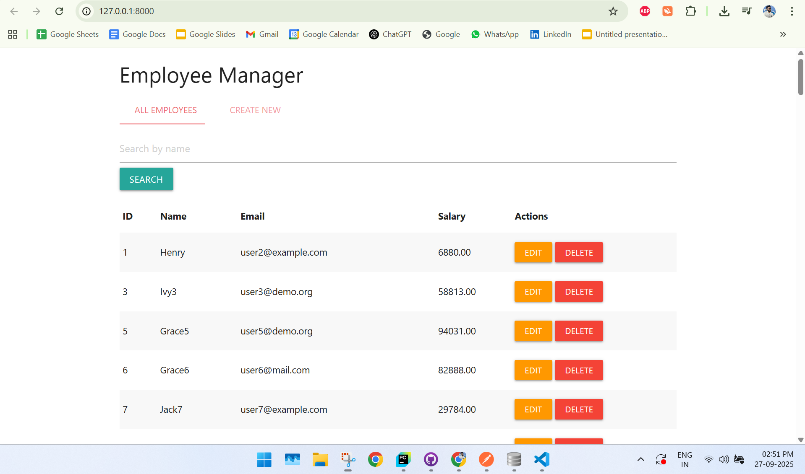
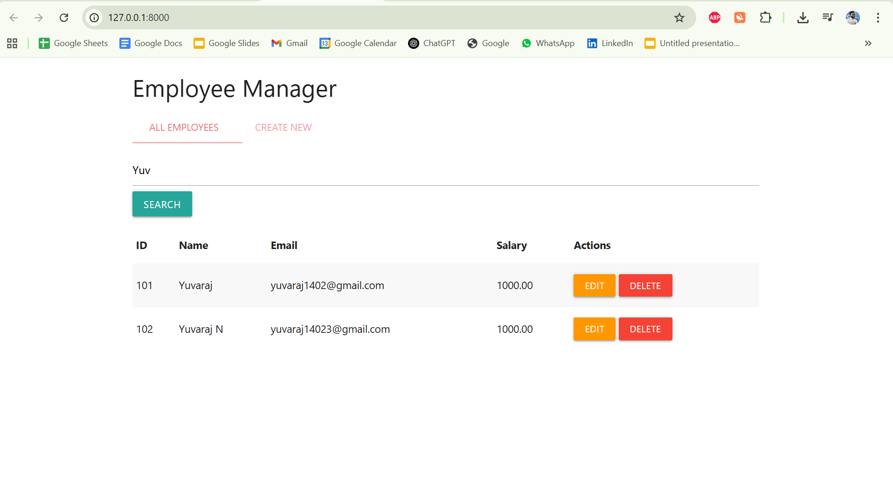
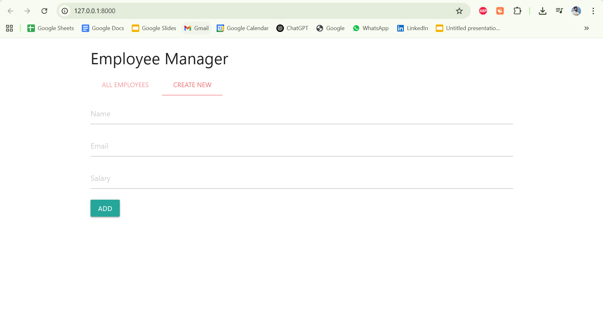
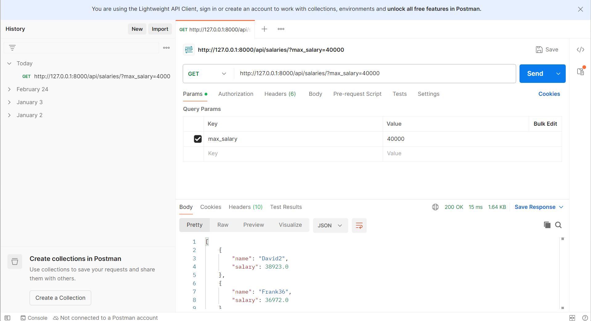

# Employee Manager (Django + Heroku + HTML)

### Screenshots

1. **UI Overview**
   

2. **Search**
   

3. **Create Employee Form**
   

4. **Postman API Test**
   

---

## Frontend Features

- View all employees in a table
- Create new employee via form (name, email, salary)
- Edit employee (name, salary)
- Delete employee (with confirmation)
- Search employee by name
- Materialize CSS styled UI with tabs

---
## URL Access

- Frontend UI: `http://127.0.0.1:8000/`
- API base: `http://127.0.0.1:8000/api/employees/`

---

---
## API Endpoints for Postman

> Base URL: `http://127.0.0.1:8000/api/employees/`

### Get all employees
```http
GET /api/employees/
```

### Search by name
```http
GET /api/employees/?search=<name>
```

### Create employee
```http
POST /api/employees/
Content-Type: application/json

{
  "name": "John Doe",
  "email": "john@example.com",
  "salary": 70000
}
```

### Update employee
```http
PATCH /api/employees/<id>/
Content-Type: application/json

{
  "name": "Updated Name",
  "salary": 80000
}
```

### Delete employee
```http
DELETE /api/employees/<id>/
```
---
## Local Setup

```bash
pip install -r requirements.txt
cp .env.sample .env
python manage.py makemigrations
python manage.py migrate
python manage.py runserver
```

## Heroku Deploy

```bash
heroku login
heroku create your-app-name
heroku addons:create heroku-postgresql:hobby-dev
heroku config:set SECRET_KEY=your-secret
git push heroku master
heroku run python manage.py migrate
heroku open
```

## Directory Structure (Important Files Only)

```
employee_project/
├── employees/
│   ├── models.py
│   ├── serializers.py
│   ├── views.py
│   ├── urls.py
│
├── frontend/
│   └── index.html         # Main UI
│
├── scripts/
│   └── seed_employees.py  # Generate dummy data
│
├── db.sqlite3             # SQLite DB
├── manage.py
├── requirements.txt
├── README.md
```

## Frontend (index.html)

Change the JS `url` to match your Heroku backend URL.


# Django Employee Manager – Project File Breakdown

### `manage.py`
Entry point to run Django project. Provides CLI to runserver, migrate, etc.

### `employee_project/__init__.py`
Marks this directory as a Python package.

### `employee_project/settings.py`
Django project settings like installed apps, DB, middleware, templates.

### `employee_project/urls.py`
Project-level URL routing. Delegates paths to app-level urls.

### `employee_project/wsgi.py`
WSGI entry point for deployment servers (Gunicorn, etc.).

### `employees/apps.py`
Registers the app config with Django.

### `employees/models.py`
Defines the Employee model with fields like name, email, salary.

### `employees/serializers.py`
Defines how Employee model instances are converted to JSON (and back).

### `employees/views.py`
Holds API views (CRUD & salary filter). Uses DRF's viewsets and function-based views.

### `employees/urls.py`
Routes API URLs to views using routers and function views.

### `employees/admin.py`
Registers Employee model in Django admin (optional for UI admin).

### `employees/tests.py`
Used for writing unit tests (optional).

### `frontend/index.html`
Material Design based UI (HTML + JS) to manage Employees.

### `scripts/seed_employees.py`
Populates DB with random employee data for testing.

### `.env`
Environment variables file to securely store DB/user config.

### `db.sqlite3`
SQLite DB file used in local development.

### `requirements.txt`
Lists all Python packages (Django, DRF, Faker, etc.). Used in deployments.

### `runtime.txt`
Specifies Python version (e.g., python-3.11.6) for Heroku.

### `Procfile`
Declares how to run the app in production (e.g., gunicorn wsgi).

### `README.md`
Project documentation and instructions.
